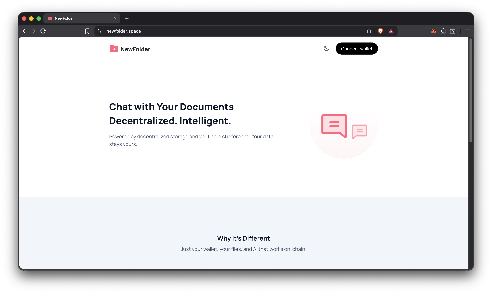
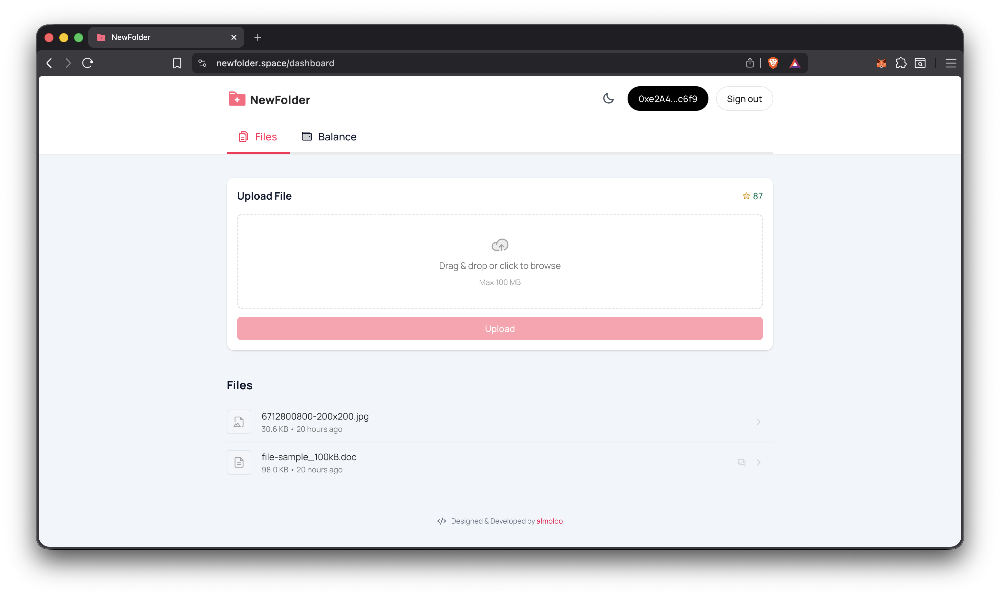
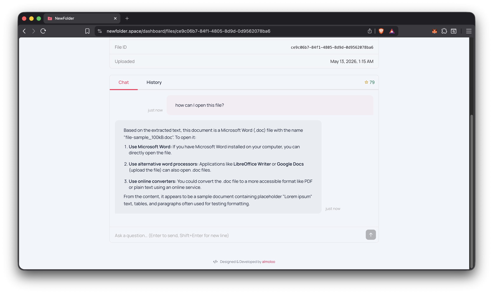
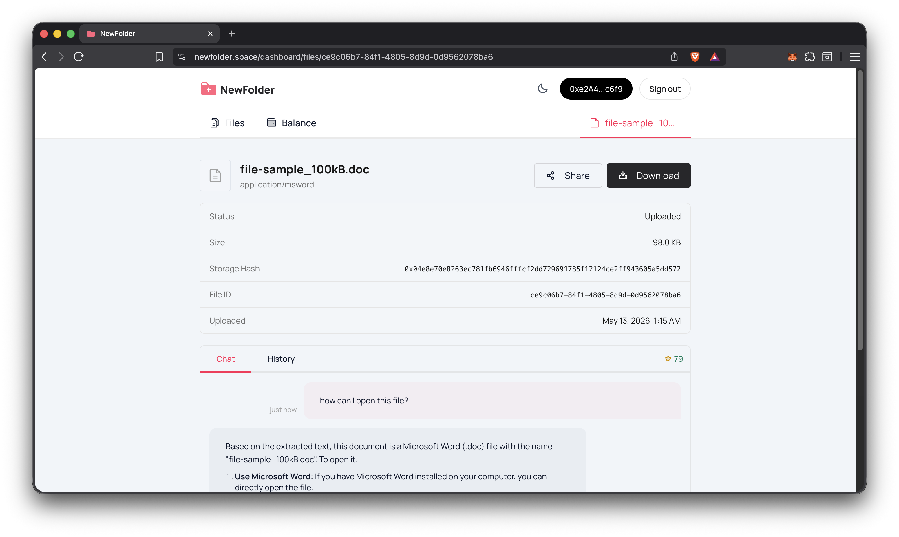
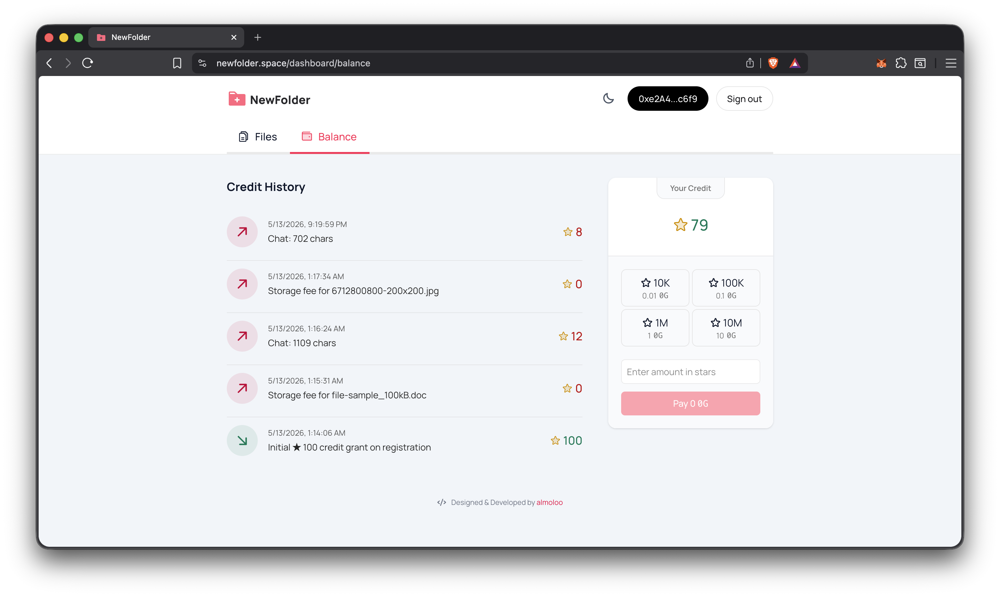
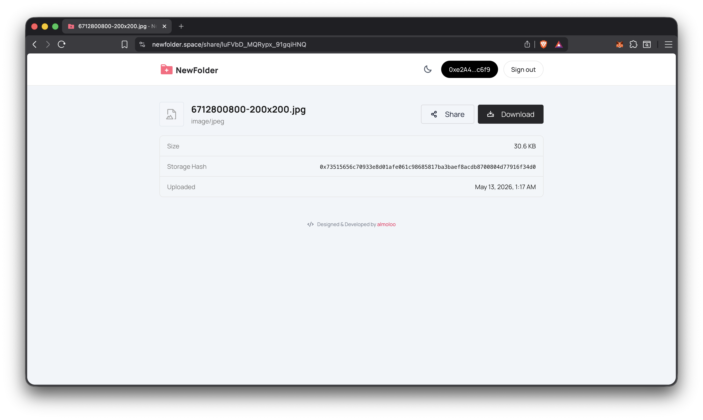

<div align="center">

# 📁 NewFolder

**Decentralized file storage with AI-powered document chat**

_Built on 0G Network — your files, your data, your AI._

[](https://nextjs.org)
[](https://0g.ai)

</div>

---

## What is NewFolder?

NewFolder is a fully decentralized document platform. Upload any file — PDF, Word, spreadsheet — store it permanently on the **0G decentralized storage network**, then have a conversation with it using **verifiable AI inference** from the 0G Compute Network. No centralized servers hold your data. No subscriptions. Pay only for what you use, with crypto.

> **Hackathon Note:** This project is built on 0G's modular Web3 infrastructure — storage, compute, and AI inference — all on-chain and verifiable.

---

## Screenshots

| Home                                             | Dashboard                                              | File Chat                                    |
| ------------------------------------------------ | ------------------------------------------------------ | -------------------------------------------- |
|  |  |  |

| File                                           | Balance                                            | Public Share                                   |
| ---------------------------------------------- | -------------------------------------------------- | ---------------------------------------------- |
|  |  |  |

---

## Key Features

- **Decentralized Storage** — Files are uploaded to the 0G storage network via content-addressed root hashes. No file can be silently deleted or tampered with.
- **AI Document Chat** — Ask anything about your files. The app downloads the file from 0G storage and routes your query to a verifiable AI inference provider on the 0G Compute Network.
- **Wallet Authentication** — Sign In With Ethereum (SIWE). No passwords, no email required.
- **Pay-Per-Use Credits** — Top up with 0G. Credits are deducted per request. No monthly fees.
- **Smart Contract Top-Ups** — The `CreditVault` contract accepts 0G top-ups and forwards them immediately to the treasury. Fully auditable on-chain.
- **Shareable Files** — Generate a public share link for any file.
- **Multi-Format Support** — PDF, DOCX, XLSX, plain text, and more.

---

## How It Works

```
User uploads file
       │
       ▼
  0G Storage SDK ──► 0G Decentralized Network (content hash stored in DB)
       │
       ▼
User sends a chat message
       │
       ▼
  File downloaded from 0G ──► Text extracted ──► Context built
       │
       ▼
  0G Compute Network ──► Verifiable AI inference provider
       │
       ▼
  Streaming response returned to user
       │
       ▼
  Credits deducted from user balance
```

Top-ups flow through the `CreditVault` smart contract → treasury wallet → 0G Compute Ledger, ensuring funds always reach the inference providers.

---

## Tech Stack

| Layer           | Technology                                         |
| --------------- | -------------------------------------------------- |
| Framework       | Next.js 16 (App Router, Turbopack)                 |
| Styling         | Tailwind CSS v4                                    |
| Auth            | Better Auth + SIWE (Sign In With Ethereum)         |
| Wallet          | RainbowKit + Wagmi + viem                          |
| Storage         | 0G Storage SDK (`@0gfoundation/0g-ts-sdk`)         |
| AI Compute      | 0G Compute SDK (`@0gfoundation/0g-compute-ts-sdk`) |
| Database        | PostgreSQL + Drizzle ORM                           |
| Smart Contracts | Solidity + Foundry                                 |
| Chain           | 0G Mainnet                                         |

---

## Smart Contract

**CreditVault** (`contracts/new_folder/src/CreditVault.sol`)

A minimal, trust-minimized top-up contract. Users send 0G to `topUpBalance()` — the contract records the contribution on-chain and immediately forwards 100% of funds to the treasury address. No funds are ever held by the contract.

```solidity
function topUpBalance() external payable;
receive() external payable; // plain transfers also work but wouldn't be credited to any off-chain account
```

Deploy:

```bash
# Galileo testnet
npm run contract:deploy:galileo

# Mainnet
npm run contract:deploy:mainnet
```

---

## Getting Started

### Prerequisites

- Node.js 20+
- PostgreSQL database
- A funded 0G wallet (for storage and compute)

### 1. Clone the repository

```bash
git clone https://github.com/almoloo/newfolder
cd newfolder
```

### 2. Install dependencies

```bash
npm install
```

### 3. Configure environment

```bash
cp .env.example .env
```

| Variable                      | Description                                         |
| ----------------------------- | --------------------------------------------------- |
| `DATABASE_URL`                | PostgreSQL connection string                        |
| `ZG_PRIVATE_KEY`              | Treasury wallet private key (pays for storage + AI) |
| `ZG_EVM_RPC`                  | 0G EVM RPC endpoint                                 |
| `ZG_INDEXER_RPC`              | 0G Storage indexer RPC endpoint                     |
| `ZG_COMPUTE_PROVIDER_ADDRESS` | 0G AI inference provider contract address           |
| `CREDIT_VAULT_ADDRESS`        | Deployed CreditVault contract address               |
| `NEXT_PUBLIC_APP_URL`         | Public URL of the app                               |
| `BETTER_AUTH_SECRET`          | Random secret for session signing                   |

### 4. Run database migrations

```bash
npm run db:migrate
```

### 5. Start the dev server

```bash
npm run dev
```

Open [http://localhost:3000](http://localhost:3000).

---

## Project Structure

```
app/
  api/              # API routes (files, chat, balance, auth, topups)
  dashboard/        # Authenticated dashboard pages
  share/            # Public file share pages
components/
  chat/             # Chat UI components
  files/            # File management components
  balance/          # Credits & top-up components
contracts/
  new_folder/       # Foundry smart contract project (CreditVault)
lib/
  ai/               # 0G Compute broker & ledger management
  storage/          # 0G Storage indexer client
  auth/             # Better Auth + SIWE configuration
  db/               # Drizzle schema & database client
```

---

## Built With ❤️ on 0G Network

This app uses 0G's full modular stack:

- **0G Storage** — Permanent, decentralized file storage with content addressing
- **0G Compute Network** — Verifiable, on-chain AI inference with TEE attestation
- **0G EVM** — Smart contracts for trustless credit management

Learn more at [0g.ai](https://0g.ai).
